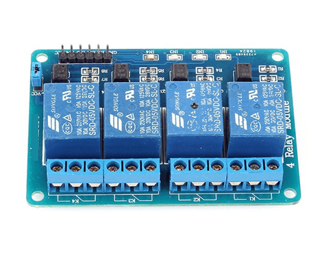

# Raspberry-Pi-Sonoff
It  is an Sonoff using Rapberry Pi

[](https://www.python.org/)                  [](https://www.python.org/downloads/release/python-360/)          [](https://pypi.python.org/pypi/ansicolortags/)


## Hardware Requirements:

#### 1.Raspberry Pi (Any Version Will Work)


#### 2.Relay Board




## Run
*Run Main.py File on RPI*
```
python main.py
```


© [Arbaz Khan](https://arbazkhan4712.github.io/Contact.html)

Licensed under the [MIT License](LICENSE)
