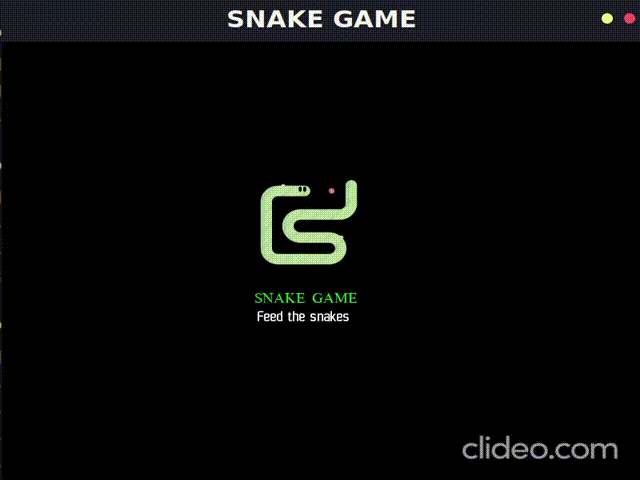

<samp>Snake-game Using Python and Pygame</samp>
---
Who has not played the historic *[Snake](https://www.itsnicethat.com/features/taneli-armanto-the-history-of-snake-design-legacies-230221)* game on Nokia mobile phones. Still, to this very day, people of all ages will have heard of Snake – they might have even played the original, or know an older person who has. I myself was addicted to the game back in my childhood. Though modern games have advanced user interfaces and better graphics, I still miss that excitement while playing them. I always wanted to recreate that excitement and feeling, Thanks to the programming languages which allow us to build such cool stuffs.

<h2><samp>Description</samp></h2>
---
The project aims to build a simple snake game using *[Python](https://www.python.org/)* and an *[Open-source](https://en.wikipedia.org/wiki/Open_source)* cross-platform library called *[Pygame](https://www.pygame.org/wiki/about)*. Though the project does not include all the functionalities of the game, It develops a simple game which is controlled by arrow keys on the keyboard. The game also records the users best score. It displays users current score on the window. Though its just a basic game it is good for beginners to get hands on experience with python and the pygame library.

<h2><samp>Uniqueness of the project</samp></h2>
---
Though there are plenty of tutorials on the Internet on building the ***Snake Game***, One unique feature of this project is that the game is made capable to store users best score. This feature makes use of a txt file which is read and overwritten each time the user's current game score is higher than previous best score. Initially the score is set to 0 in a txt file. This txt file has to be in the same folder/directory where the .py file is stored.
I took the game prototype form [here](https://www.edureka.co/blog/snake-game-with-pygame/). The author has given a detailed explanation on how to implement a snake game using python from scratch. *I recommend you to check it once*.

<h2><samp>Structure of the repository</samp></h2>
---
Structure of my github repository for snake game is as follows,
- Previous .py files - This is folder contains the .py files which i worked on while implementing the project. It's contents can be treated as versions from beginning prototype till final implementation.
- best_score.txt - This txt file keeps track of users best score.
- game_over.png - this image is displayed when the game ends.
- README.md - This markdown file contains details about the project.
- snake_game.py - This is the main .py which implements the game.
- snake.gif - This gif shows a final implementation of the game.
- Welcome.png - This image is displayed at the start of the game.

<h2><samp>How to run the game</samp></h2>
**Note**: Before you try to run the game make sure you have installed *pygame* library using
the command. ***pip install pygame***.
To run the game you have to download the Snake Game folder or copy each of the files in Snake_Game folder
to a folder on you local machine.
If make the changes in snake_game.py to load the images.
Run the snake_game.py file using the below command.
**python snake_game.py**

<!--[My Snake game repository](https://github.com/SuhasBRao/Snake-game)-->

<h2><samp> Here's a glimpse of the game </samp></h2>

  

